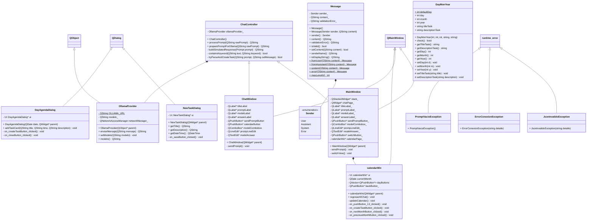

# Diagrama de clases — AgentePETE

```mermaid
classDiagram
    %% Clases Base de Qt y C++
    class QMainWindow
    class QDialog
    class QObject
    class runtime_error

    %% Interfaz de Calendario
    class calendarWin {
        - Ui::calendarWin* ui
        - QDate currentMonth
        - QVector~QPushButton*~ dayButtons
        - QPushButton* backButton_
        + calendarWin(QWidget* parent)
        + regresarAlChat() void
        - updateCalendar() void
        - on_pushButton_13_clicked() void
        - on_createTaskButton_clicked() void
        - on_nextMonthButton_clicked() void
        - on_previousMonthButton_clicked() void
    }
    QMainWindow <|-- calendarWin

    %% Lógica de Controlador
    class ChatController {
        - OllamaProvider ollamaProvider_
        + ChatController()
        + processPrompt(QString rawPrompt) QString
        + preparePromptForOllama(QString rawPrompt) QString
        - buildSimulatedResponse(Prompt prompt) QString
        - containsKeyword(QString text, QString keyword) bool
        - tryParseAndCreateTask(QString prompt, QString outMessage) bool
    }
    ChatController *-- OllamaProvider

    %% Ventana de Chat Independiente
    class ChatWindow {
        - QLabel* titleLabel
        - QLabel* promptLabel
        - QLabel* modelLabel
        - QLabel* answerLabel
        - QPushButton* sendPromptButton
        - QPushButton* calendarButton
        - QComboBox* modelCombobox
        - QLineEdit* prompLineEdit
        - QTextEdit* modelAnswer
        + ChatWindow(QWidget* parent)
        - sendPrompt() void
    }
    QMainWindow <|-- ChatWindow
    ChatController <|-- ChatWindow

    %% Diálogos
    class DayAgendaDialog {
        - Ui::DayAgendaDialog* ui
        + DayAgendaDialog(QDate date, QWidget* parent)
        + addTaskCard(QString title, QString time, QString description) void
        - on_createTaskButton_clicked() void
        - on_closeButton_clicked() void
    }
    QDialog <|-- DayAgendaDialog

    class NewTaskDialog {
        - Ui::NewTaskDialog* ui
        + NewTaskDialog(QWidget* parent)
        + getTitle() QString
        + getDescription() QString
        + getDateTime() QDateTime
        - on_saveButton_clicked() void
    }
    QDialog <|-- NewTaskDialog

    %% Modelos de Datos
    class DayMonYear {
        + int defaultDay$
        + int day
        + int month
        + int year
        + string titleTask
        + string descriptionTask
        + DayMonYear(int, int, int, string, string)
        + check() bool
        + getTitleTask() string
        + getDescriptionTask() string
        + getDay() int
        + getMonth() int
        + getYear() int
        + setDay(int d) void
        + setMonth(int m) void
        + setYear(int y) void
        # setTitleTask(string title) void
        # setDescriptionTask(string description) void
    }

    class Sender {
        <<enumeration>>
        User
        Assistant
        System
        Error
    }

    class Message {
        - Sender sender_
        - QString content_
        - QString validationError_
        + Message()
        + Message(Sender sender, QString content)
        + sender() Sender
        + content() QString
        + validationError() QString
        + isValid() bool
        + setContent(QString content) bool
        + senderName() QString
        + toDisplayString() QString
        + fromUser(QString content)$ Message
        + fromAssistant(QString content)$ Message
        + system(QString content)$ Message
        + error(QString content)$ Message
        + maxLength()$ int
    }
    Message *-- Sender

    %% Ventana Principal
    class MainWindow {
        - QStackedWidget* stack_
        - QWidget* chatPage_
        - QLabel* titleLabel_
        - QLabel* promptLabel_
        - QLabel* modelLabel_
        - QLabel* answerLabel_
        - QPushButton* sendPromptButton_
        - QComboBox* modelCombobox_
        - QLineEdit* prompLineEdit_
        - QTextEdit* modelAnswer_
        - QPushButton* switchButton_
        - calendarWin* calendarPage_
        + MainWindow(QWidget* parent)
        - sendPrompt() void
        - switchView() void
    }
    QMainWindow <|-- MainWindow
    ChatController <|-- MainWindow
    MainWindow *-- calendarWin

    %% Proveedor de API Local
    class OllamaProvider {
        - QString OLLAMA_URL$
        - QString modelo_
        - QNetworkAccessManager networkManager_
        + OllamaProvider(QObject* parent)
        + enviarMensaje(QString mensaje) QString
        + setModelo(QString modelo) void
        + modelo() QString
    }
    QObject <|-- OllamaProvider

    %% Excepciones Personalizadas
    class PromptVacioException {
        + PromptVacioException()
    }
    runtime_error <|-- PromptVacioException

    class ErrorConexionException {
        + ErrorConexionException(string detalle)
    }
    runtime_error <|-- ErrorConexionException

    class JsonInvalidoException {
        + JsonInvalidoException(string detalle)
    }
    runtime_error <|-- JsonInvalidoException
```
