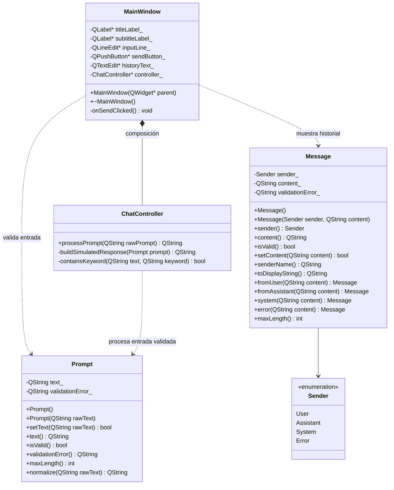

# Diagrama de clases — AgentePETE

```mermaid
classDiagram
    class MainWindow {
        -QLabel* titleLabel_
        -QLabel* subtitleLabel_
        -QLineEdit* inputLine_
        -QPushButton* sendButton_
        -QTextEdit* historyText_
        -ChatController* controller_
        +MainWindow(QWidget* parent)
        +~MainWindow()
        -onSendClicked() void
    }

    class ChatController {
        +processPrompt(QString rawPrompt) QString
        -buildSimulatedResponse(Prompt prompt) QString
        -containsKeyword(QString text, QString keyword) bool
    }

    class Prompt {
        -QString text_
        -QString validationError_
        +Prompt()
        +Prompt(QString rawText)
        +setText(QString rawText) bool
        +text() QString
        +isValid() bool
        +validationError() QString
        +maxLength() int
        +normalize(QString rawText) QString
    }

    class Message {
        -Sender sender_
        -QString content_
        -QString validationError_
        +Message()
        +Message(Sender sender, QString content)
        +sender() Sender
        +content() QString
        +isValid() bool
        +setContent(QString content) bool
        +senderName() QString
        +toDisplayString() QString
        +fromUser(QString content) Message
        +fromAssistant(QString content) Message
        +system(QString content) Message
        +error(QString content) Message
        +maxLength() int
    }

    class Sender {
        <<enumeration>>
        User
        Assistant
        System
        Error
    }

    MainWindow *-- ChatController : composición
    MainWindow ..> Prompt : valida entrada
    MainWindow ..> Message : muestra historial
    ChatController ..> Prompt : procesa entrada validada
    Message --> Sender
```
